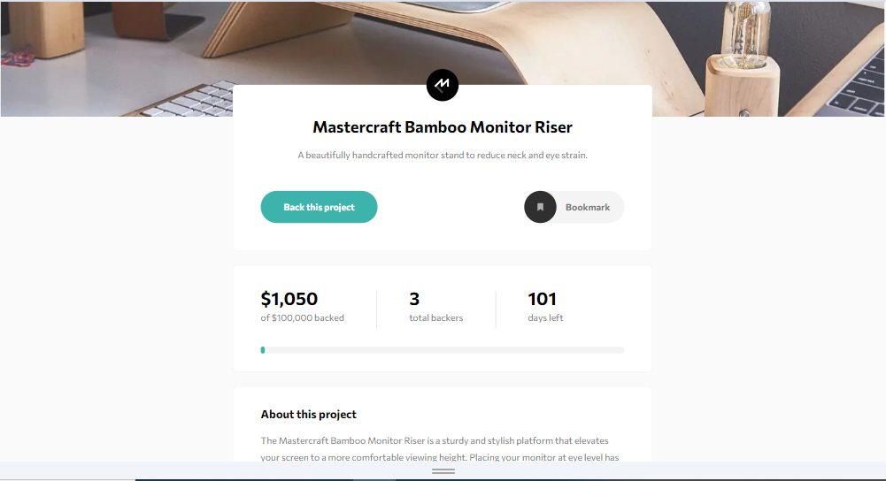

# Frontend Mentor - Advice generator app

This is a solution to the [Crowdfunding product page on Frontend Mentor](https://www.frontendmentor.io/challenges/crowdfunding-product-page-7uvcZe7ZR/hub). Frontend Mentor challenges help you improve your coding skills by building realistic projects. 

## Table of contents

- [Overview](#overview)
  - [The challenge](#the-challenge)
  - [Screenshot](#screenshot)
  - [Links](#links)
- [My process](#my-process)
  - [Built with](#built-with)
  - [What I learned](#what-i-learned)
  - [Continued development](#continued-development)
  - [Useful resources](#useful-resources)
- [Author](#author)
- [Acknowledgments](#acknowledgments)

**Note: Delete this note and update the table of contents based on what sections you keep.**

## Overview

### The challenge

Users should be able to:

- Make a selection of which pledge to make
- See an updated progress bar and total money raised based on their pledge total after confirming a pledge
- See the number of total backers increment by one after confirming a pledge
- Toggle whether or not the product is bookmarked
- View the optimal layout depending on their device's screen size
- See hover states for interactive elements

### Screenshot



### Links

- Solution URL: [solution URL Frontenmentor](https://www.frontendmentor.io/challenges/advice-generator-app-QdUG-13db/hub/sass-css-flexbox-parcel-mobile-first-async-functions-HyUda_185)
- Live Site URL: [Advice generator app by Esteban Diaz](https://admirable-marzipan-9e2f01.netlify.app/)

## My process

### Built with

- Semantic HTML5 markup
- Modules CSS
- Flexbox
- [NextJS](https://nextjs.org/) - React framework 
- [ReactJS](https://react.dev/) - Library javascript for web user interfaces
- [FontAawesome](https://fontawesome.com/) - Font icons
- [Tailwind](https://tailwindui.com/) - Framework CSS

### What I learned

I learned how to use the different hooks available in React, such as useState and useContext. An example of this was the need to use a global state to update total money raised and the number of backers:


```js
    const pledgeContext = createContext(null)
    export const usePledgeContext = () => useContext(pledgeContext)

    const PledgeProvider = ({children}) =>{
        const [backed, setBacked] = useState(0)
        const [backers, setBackers] = useState(0)
        const [leftDays, setLeftDays] = useState(101)
        const countPledge = (value) =>{
        setBacked(prevState =>{
            let newPledges = prevState;
            newPledges += value
            return newPledges
        })
        }
        const countBackers = () =>{
        setBackers(prevState =>{
            let newBackers = prevState;
            newBackers += 1
            return newBackers
        })
        }
        return (
            <pledgeContext.Provider value={{backed, backers, leftDays, countPledge, countBackers}}>
                {children}
            </pledgeContext.Provider>
        )
```

### Continued development

This is one of my first projects using Next.js, and I would like to continue developing and acquiring more skills using this framework.


## Author

- Frontend Mentor - [@esteban2368](https://www.frontendmentor.io/profile/esteban2368)